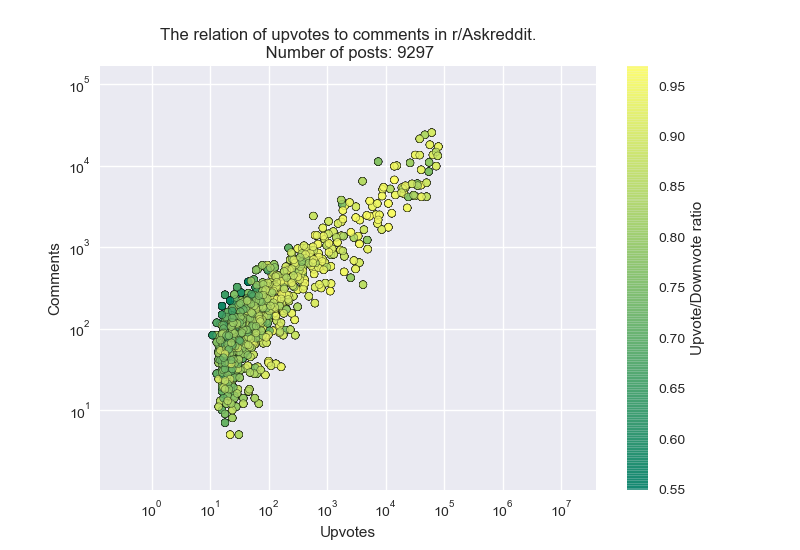

# Reddit Analysis

## The basic idea of the project is to use the analyzed data to optimize the posting of articles.

## A brief overview of Reddit:
The online platform Reddit is composed of multiple subreddits, which are divided into topics (e.g., politics, nature pictures, memes, etc.). In each subreddit, users can share a post, which can be commented on, given an "upvote" or "downvote". The latter represent a scoring system for the success of a post. Based on the success of a post, they are divided into the following categories: "new", "rising", "hot", "top". Each post first appears in the "new" section. More successful posts move to the "rising" section. From there, only a handful make it to "hot". Each subreddit also has the option to sort posts under "top", where only the most successful posts of all time are listed. Posts can also be rewarded with "awards", which users pay for. Users can also reward comments from others, which are also scored with "upvotes"/"downvotes". Based on certain algorithms of post or comment success, users accumulate "karma" (represented by a number/points), e.g., 10 karma = little, 200,000 karma = a lot.

## A brief overview of the work process
The work was conducted in English. We divided it into two parts:

- Daily data, Liam Mislej.
- User data (data collected from various profiles), Gašper Kovačič.

### Daily data
It would not be possible to read all the posts on Reddit, as thousands are posted daily. We created a program that reads various posts from different subreddits on a daily basis. Before that, we compiled a list of subreddits that we would read. We divided them into 4 groups:

- normal, the top 178 subreddits by number of followers.
- nsfw, the top 21 "nsfw" (not safe for work) subreddits, mostly subreddits that show nudity.
- europe, randomly selected 15 subreddits of European countries.
- usa, the top 24 subreddits by number of followers from North American countries (despite the "usa" label).

In total, 238 subreddits were reviewed daily, with the number of posts varying depending on the individual subreddit, ranging from 0 to 100. After eleven days, a total of 126,093 posts were read, which is approximately 11,463 per day.

We ran the program named reading_daily_data.py for 11 consecutive days at approximately the same time. For each subreddit from the mentioned groups, the program read data from 0 to 100 of the best posts from the past 24 hours. Interestingly, this took approximately 2 hours on average. Since various subreddits receive more than 1000 posts per day, it was not possible to read them all. Therefore, the data does not represent the entire population.

During the daily data reading, we read and stored the following data for each post:

- number of 'upvotes'
- number of comments
- posting time
- length of the post title (in words and characters).
- author's name (username), later used in User data.
- upvote downvote ratio (Percentage of 'upvotes' compared to all ratings, i.e., 'downvotes').
- number of awards received.
- number of 'upvotes' of the 10 best comments.

### User data
We also queried about users; from the user object, we extracted the following data:
- number of comment karma
- number of post karma
- number of comments
- number of posts
- whether the user is a moderator or has premium status
- frequency of commenting/posting by hour and month
- comments with more than 1000 karma
- most frequently visited 'subreddits', based on comments/posts

The secondary data collection program took a list of users, compiled from daily data reading. Other auxiliary programs then modified this data for use in drawing histograms.
When extracting user data, we limited ourselves to 100 users due to time complexity when observing other 'subreddits' that users visit, in addition to the one from which they were taken. For the histogram of how many users are moderators or have premium status, we looked at 1000 instances.
Data that was discontinued due to judged uselessness includes: number of post/comment karma, number of comments/posts, and comments with more than 1000 karma.

## Programs Used
There are two folders in the repository: **main** and **secondary**. The main folder contains all the programs and various files needed to run the main.py program. With this, it is possible to view all the graphs, histograms, etc. The program includes a simple user interface through which all the displayed data can be plotted. This data refers to the previously mentioned groups of subreddits (normal, nsfw...), individual subreddits, or all together. The secondary folder contains all the programs that were used for data collection and editing.

## Libraries Used:
#### Not required for the main.py program to function:
- praw (API for collecting data from Reddit)
- prawcore
#### Required for the main.py program to function:
- json
- numpy
- matplotlib

## Analysis (Daily Data)
### Does the posting time affect the success of a post?
Does the time at which we post to a particular subreddit affect the outcome of the post? Let's interpret the outcome of a post by its success, which is measured by the number of 'upvotes'. For example, a post that received a total of 20 'upvotes' is less successful than another that received 1000+. On Reddit, we can observe that the number of successful posts is small compared to unsuccessful ones. This is likely due to the sorting algorithm. It goes through the categories of posts (new, rising, hot). Most posts do not move through these categories; only a handful of the best ones move to the next category. In each category, the post is shown to an increasing number of other users and thus has the opportunity to receive a larger number of 'upvotes'.

We collected data on the timing of all posts, and we also stored their success ('upvotes'). The data is shown in the graphs below. The top one shows the average number of "upvotes" that were posted at a particular hour. The bottom one shows the number of posts per hour.

We notice that the graphs are not linear, and we will also show later that they are likely dependent on each other. On the bottom graph, we can assume that the number of posts increases with the number of users on the website at a particular hour. This is likely true because if there are more users on the site, more of them will also make a post. We notice two peaks and two valleys. Thus, there are more users at certain hours than others. For example, around 3 PM and between 8 PM - 3 AM, there are many more users than at other hours. From the data collected, it is difficult to assume why this would be the case. Therefore, we will compare different groups of subreddits in the future.

If we compare both 'curves' at a specific hour, shown below:

Comparing the curves tells us the following. Between 10 AM and 11 AM (green vertical line), posts on average received more 'upvotes'. We notice that this is just before the increase in the number of users. We can say that at that hour, the number of users is increasing. Posts made at that time are seen by more people who can give them an 'upvote'. This, of course, applies on average; the post must still be of good quality regardless. If we look at the red vertical line, we notice that posts posted at that hour receive fewer 'upvotes' on average, as the number of users and, consequently, the visibility of the post decreases drastically. Thus, we can conclude that the posting time affects its success.

### Why does the number of users differ so much?
Since Reddit is a world-renowned website, the previous graph in relation to time does not help us answer the above question. Since we divided users into groups, we can compare the subreddits of two different groups.

So we will compare the subreddits of European countries and North American countries.

When comparing European and American subreddits, we notice the similarity of the underlying curves. Both have peaks, one slightly larger than the other. They differ in the time shift. Although the time is not written on the image, it is given in UTC. We see that the peak for European subreddits is around 12 PM, while for American subreddits, it is around 8 PM. The peaks match because the average time in America is +8 UTC, while in Europe, it is around 0 UTC. The larger peaks in both graphs occur around lunchtime.

We allow ourselves to infer the following reasons for growth:
This would be a little harder to prove, but we can assume:
- The number of users starts to increase in the morning when most users wake up.
- Around noon, the number decreases, probably due to lunch.
- It starts to increase again in the evening when most people go to bed but still browse their phones a little beforehand.

## Characteristics of Different Subreddit Groups
We will look at some scatter plots of posts.

Namely: the number of comments versus the number of 'upvotes', with color representing the 'upvote/downvote ratio' (the percentage of 'upvotes' compared to all ratings, i.e., 'upvotes' + 'downvotes', and is between 0 and 1). Posts with large numbers of comments and 'upvotes' are successful and usually have a higher upvote/downvote ratio. Since different groups/subreddits have different numbers of followers, we will not focus on the magnitudes of the aforementioned numbers.

In the following graphs, each dot represents a post, the y-axis represents its number of comments, the x-axis represents the number of upvotes, and the color represents its 'upvote/downvote ratio' (higher is better). The axes are given on a logarithmic scale because the data is quite scattered.

#### Subreddits from the normal group.
There is a lot of diversity in the behavior of certain subreddits, but we can still extract something.

The shape indicates that the number of comments increases with the number of 'upvotes'. We can already observe this by looking at posts on Reddit; when more users see a post, it receives more 'upvotes' and more comments at the same time.

We also notice coloring on the left side, where posts with fewer comments/'upvotes' are more green. This means they have a worse 'upvote/downvote' ratio. We attribute this to the algorithms for sorting posts on Reddit. Posts with worse ratios are usually inferior and thus not seen by many people because they do not move through the sorting groups (new, rising, hot...).

#### Subreddits in the nsfw group
This group of subreddits includes all those that are not suitable "for the public". Mostly, pornography is posted here, while in some, girls or guys post their nude pictures.

If we look at what the scatter plot would look like:

Interestingly, it is more yellow, which means that the posts are rated better. At the same time, there are also fewer comments compared to some other groups; this is not immediately apparent, but if we look at the numbers on the axes, we notice it.
I could not say with certainty why this is the case, but I assume that people are more accepting of nudity.

#### Subreddits of different countries

 

Two 'branches' appear. The right one is mostly normal, as we have observed so far. The left one indicates a larger number of comments. At the same time, everything is colored more green, which means that the posts are rated worse. This would be mainly because such subreddits mostly post various questions, political opinions, or news. There is a big difference in personal opinions, consequently more comments and worse ratings.

#### Some interesting shapes in various subreddits

##### Askreddit
This subreddit is dedicated to questions from users intended for other users. Thus, it is more focused on the comments of posts rather than the content of the posts themselves. The posts themselves only include one question.

On the left side, we see a large 'jump' upwards, which can be explained by the fact that the subreddit is more focused on comments. If we look at the subreddit itself, we notice that posts initially get a lot of comments and only then 'upvotes'. This would explain that 'jump'.

##### Politics

The subreddit is dedicated to political news and opinions.

A fairly linear shape, comments increase with the number of 'upvotes', but there are slightly more of them than in normal subreddits. We also see some dots (outliers) that stand out; there, quite a few conversations probably developed in the comments, given the nature of the subreddit.

#### Conclusion

In all the graphs shown above, we can observe that they are more green (worse rated) on the left side, and that posts with more comments are usually rated worse. This can be explained by the fact that controversial posts trigger more diverse opinions, and thus users are more inclined to comment.

### Sorting
The following is a display of two types of bar charts, subreddits ranked by different parameters.

#### Awards
In Reddit, we know awards, they differ in value and appearance. If a user really likes a post, they can give it one of many awards. The awards are paid for with Reddit currency called coins, which we buy with real money.

Here we used only the normal ones such as:
- silver 100 coins 0.40€
- gold 500 coins 2.30€
- platinum 1800 coins 7.00€

#### Ranking by number of gold awards

#### Ranking by total value of all awards

In first place is the subreddit Gonewild, which falls under the nsfw category and is based on 'nudes' (naked pictures) mostly of girls. In addition to having far fewer followers than the others on the list, this subreddit is in first place in terms of the number of awards, interesting!

## Histograms of User Data

#### Ratio of users who are moderators, have premium status, those who have both, and normal users

The histogram is based on a population of ~11000 users.

The proportion of users who are moderators is 6.5%; the proportion of users with premium status: 16.7%; the proportion of users with both: 5.8%, and the remaining ~71%.

The histogram does not tell us much. The conclusion that can be drawn based on what is shown is that those users who have premium status are more active users of Reddit than others, and that if a user is a moderator, it is not necessarily the case that they themselves are very active in posting or commenting. The proportion of users without anything are those users who barely comment and post; let's say they are more involved in adding visibility to posts or comments by assigning 'upvotes' or donating premium status.

#### What users of certain 'subreddits' visit the most, besides the one being viewed

This histogram draws from the frequency of posting and commenting, where the user's profile and their activities were examined. That is: comments and posts were counted, along with the attached names of 'subreddits', and then separated into the 14 'subreddits' where users are most active.

The image above is an example of one of the viewed users of a 'subreddit'.

Based on the histogram, we can roughly conceive what the user is actually doing on Reddit, or what kind of content they are viewing. If I go a step further, a little too far, we could guess the age group of users based on some histograms. An example of such a histogram is 'dankmemes', which is not the one above. In short, we get a picture of the interests of users; the purpose of using the Reddit website: entertainment, information, learning, etc.

#### Direct comparison of interests of seemingly opposing 'subreddits'

The last histogram is based on data where the visited 'subreddits' of users were directly compared with each other. 10 are included, where the 'subreddits' that users of both compared 'subreddits' visit the most appeared. The number of connections tells us how many users of the compared 'subreddits' visit a 'subreddit' common to them.

The image above is an example of one of 6 comparisons.

### All the above shown graphs, diagrams, etc. can be plotted using the main.py program. In addition to those listed, it includes many options for different sorting or display for specific groups, subreddits... There is simply too much to summarize here briefly.

